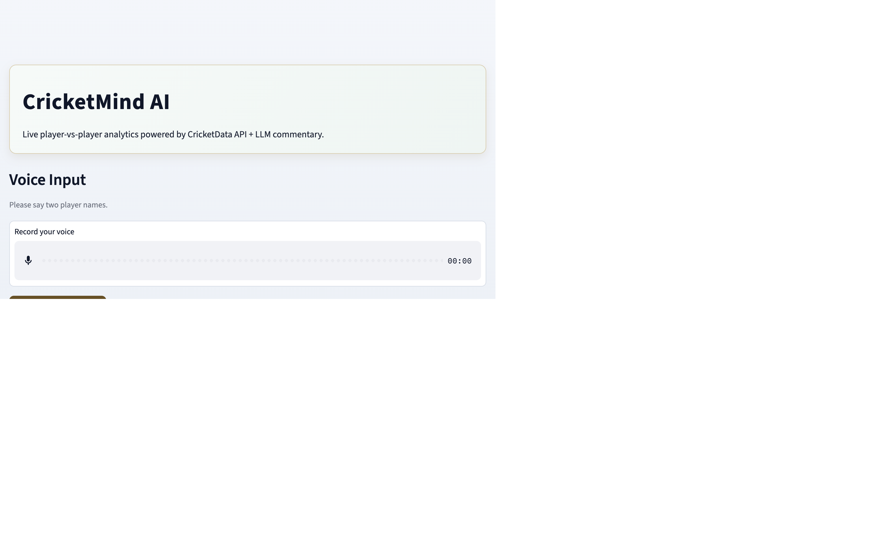
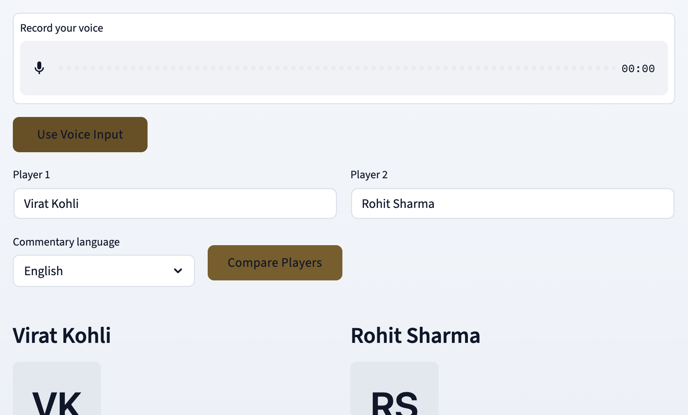

# CricketMind AI

CricketMind AI helps you compare two cricket players using live stats, AI analysis, and voice-assisted input.

Live demo: https://huggingface.co/spaces/siddu9/cricketmind-ai

## What This App Does

- Compare any two players with one click.
- Show runs, average, strike rate, and a bar-chart comparison.
- Generate AI commentary, verdict, and winner confidence.
- Support voice input for player names.
- Read out commentary with text-to-speech.
- Support commentary in English, Hindi, and Kannada.

## Screenshots

### 1) Home and Voice Input



### 2) Comparison Output



### 3) Stats and Chart Section


## How It Works

1. You enter or speak two player names.
2. The backend fetches player data from CricAPI.
3. The LLM builds a structured analysis and commentary.
4. The UI renders stats, charts, insights, and verdict.
5. TTS generates playable audio commentary.

## Tech Stack

- Python 3.13+
- FastAPI
- Streamlit
- Groq SDK
- gTTS
- matplotlib
- numpy
- requests
- python-dotenv

## Project Structure

- app.py: FastAPI app and analyze endpoint
- analyst.py: data fetch and LLM orchestration
- ui.py: Streamlit frontend and visualization
- stt.py: speech-to-text and player extraction logic
- voice.py: standalone voice interaction script
- requirements.txt: Python dependencies
- start.sh: starts backend and frontend in Docker runtime
- Dockerfile: image build for deployment

## Quick Start (Local)

1. Clone the repo and open it.

2. Create and activate virtual environment.

```bash
python -m venv .venv
source .venv/bin/activate
```

3. Install dependencies.

```bash
pip install -r requirements.txt
```

4. Create .env file in project root.

```env
GROQ_API_KEY=your_groq_api_key
CRICAPI_KEY=your_cricapi_key
```

5. Start backend API.

```bash
uvicorn app:app --reload
```

6. Start Streamlit in a new terminal.

```bash
streamlit run ui.py
```

7. Open the app.

- UI: http://localhost:8501
- API health check: http://127.0.0.1:8000/

## Deployment (Hugging Face Spaces)

This repo is configured for Docker Spaces.

1. Create a new Hugging Face Space with Docker SDK.
2. Add secrets in Space settings.
   - GROQ_API_KEY
   - CRICAPI_KEY
3. Push this repo to your Space remote.
4. Wait for the build to complete.

## Notes

- Voice transcription quality depends on microphone quality and network stability.
- STT requires valid Groq API credentials.
- Player matching can be improved over time by extending aliases in stt.py.
